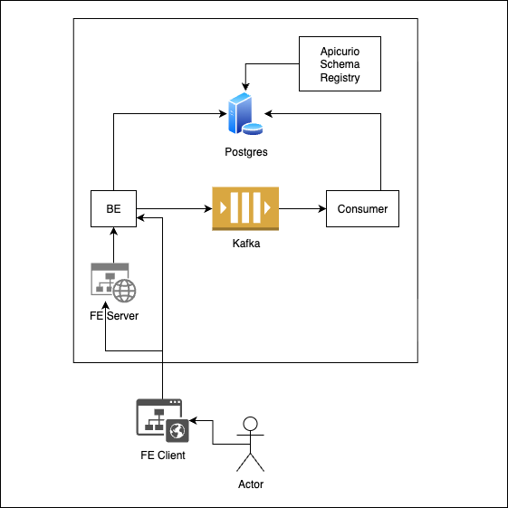

# Url Shortner App Pet Project (myurlshortner)

This repo consists of multiple applications:
- [Url Shortner App Pet Project (myurlshortner)](#url-shortner-app-pet-project-myurlshortner)
  - [BE](#be)
  - [Consumer](#consumer)
  - [FE](#fe)
  - [Postgres](#postgres)
  - [Kafka](#kafka)
  - [Schema Registry](#schema-registry)
  - [Api Gateway](#api-gateway)
- [Environments](#environments)
- [Setup](#setup)
- [Architecture](#architecture)
- [Demo](#demo)


## BE

This app handles user redirect requests and the management of short links.

- BuildTool: Gradle
- Language: Java 21
- Framework: Quarkus

## Consumer

This app handles user events that BE produces. 

- BuildTool: Gradle
- Language: Kotlin (Java 21)
- Framework: Spring

## FE

This is the FE of the application.

- Build tool: NPM 
- Language: Typescript
- Framework: Next.JS (Next 15, React 19)

## Postgres

This is the database that is shared between backend applications.
- Instance: CloudNativePG (Postgres 17.5)
- Manifest: kubectl apply --server-side -f \
  https://raw.githubusercontent.com/cloudnative-pg/cloudnative-pg/release-1.27/releases/cnpg-1.27.0.yaml

## Kafka

This is the event platform used to transport events in current system.

1 topic is expected:
  - shortened-url-events

## Schema Registry

This is the schema registry that store the schemas of the events used in the project. Apicurio is the implementation.

The schema has to be added to the registry.


## Api Gateway

This is the gateway / reverse proxy used for our implementation.
- Instance: [NGINX](https://gateway-api.sigs.k8s.io/implementations/#nginx-gateway-fabric)
- Manifest: 
  - kubectl apply -f https://github.com/kubernetes-sigs/gateway-api/releases/download/v1.3.0/standard-install.yaml
  - kubectl kustomize "https://github.com/nginx/nginx-gateway-fabric/config/crd/gateway-api/standard?ref=v2.1.2" | kubectl apply -f -
  - kubectl apply -f https://raw.githubusercontent.com/nginx/nginx-gateway-fabric/v2.1.2/deploy/default/deploy.yaml


# Environments
- local
  - This is for local development.
  - Dependencies are in-memory or mocked.
- dev
  - This is for docker compose deployment.
  - Also can be used for local development.
  - Dependencies run as docker containers.
- prod
  - This is for kubernetes deployment.
  - Dependencies run as kubernetes objects, or docker images.

# Setup

Makefile is available to run and setup the environment needed.

```bash
make dev
```

```bash
make prod
```

It may take a while to build images, also kafka and postgres may take a while to be ready.

> The schema registry is also available in dev:8901 prod:8888

```bash
kubectl port-forward apicurio-registry 8888:8888
curl -X POST http://localhost:8888/apis/registry/v3/groups/com.acme.events/artifacts \
  -H "Content-Type: application/json" \
  --data-raw '{
    "artifactId": "ShortenedUrlUserEvents",
    "artifactType": "AVRO",
    "name": "ShortenedUrlUserEvents",
    "firstVersion": {
        "content": {
            "content": "[{\"type\":\"record\",\"name\":\"ShortenedUrlUserEvents\",\"namespace\":\"com.acme.events\",\"fields\":[{\"name\":\"userAccessedShortenedUrlEvent\",\"type\":[\"null\",\"UserAccessedShortenedUrl\"],\"default\":null},{\"name\":\"userCreatedShortenedUrlEvent\",\"type\":[\"null\",\"UserCreatedShortenedUrl\"],\"default\":null},{\"name\":\"userUpdatedOriginalUrlEvent\",\"type\":[\"null\",\"UserUpdatedOriginalUrl\"],\"default\":null}]},{\"type\":\"record\",\"name\":\"UserAccessedShortenedUrl\",\"namespace\":\"com.acme.events\",\"fields\":[{\"name\":\"unique_identifier\",\"type\":[\"null\",\"string\"],\"default\":\"null\"},{\"name\":\"shortened_url\",\"type\":\"string\"},{\"name\":\"original_url\",\"type\":\"string\"},{\"name\":\"user_agent\",\"type\":\"string\"},{\"name\":\"accessed_at\",\"type\":[\"null\",\"string\"],\"doc\":\"ISO 8601 Timestamp\",\"default\":\"null\"}]},{\"type\":\"record\",\"name\":\"UserCreatedShortenedUrl\",\"namespace\":\"com.acme.events\",\"fields\":[{\"name\":\"unique_identifier\",\"type\":\"string\"},{\"name\":\"original_url\",\"type\":\"string\"},{\"name\":\"created_at\",\"type\":\"string\",\"doc\":\"ISO 8601 Timestamp\"}]},{\"type\":\"record\",\"name\":\"UserUpdatedOriginalUrl\",\"namespace\":\"com.acme.events\",\"fields\":[{\"name\":\"unique_identifier\",\"type\":\"string\"},{\"name\":\"new_original_url\",\"type\":\"string\"},{\"name\":\"updated_at\",\"type\":\"string\",\"doc\":\"ISO 8601 Timestamp\"}]}]",
            "contentType": "application/json",
            "references": [ ]
        }
    }
}'
```
> The ui is also available instead. (dev:8888, prod:8080)

# Architecture



# Demo
[Available video demo](demo.mov)
